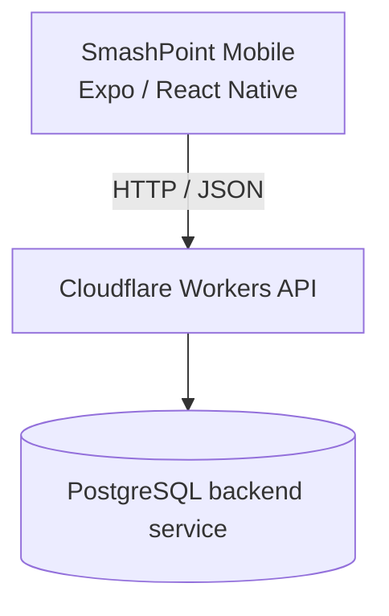

# SmashPoint Mobile Architecture

## System Architecture



The mobile repository owns the client. Backend persistence and business APIs are maintained in the separate `badminton-api` repository.

## Mobile Architecture

Expo Router maps files under `app/` to routes. Screens use feature helpers and hooks in `src/features/`, shared components in `src/components/`, and common tokens in `src/theme/`. API calls are centralized through Axios in `src/api/apiClient.ts`.

React Query owns remote data fetching, caching, invalidation, loading, and error state. Zustand owns the in-memory authentication/session state. SecureStore persists access tokens, refresh tokens, and the selected workspace.

## Route Groups

- `(auth)` — login, OTP verification, and workspace selection.
- `(player)` — player home, profile, tournaments, registrations, Friendly Matches, fixtures, scoring, results, and medals.
- `(organizer)` — tournament creation, registrations, fixtures, matches, dashboard, and organizer notifications.
- `(admin)` — administrative review, tournaments, and notifications.

These are Expo Router route groups; their names organize navigation without becoming URL segments.

## Data Flow

```text
Screen
  ↓
Feature hook/API helper
  ↓
src/api/apiClient.ts
  ↓
Configured backend API
```

React Query hooks commonly wrap the feature API helpers. Realtime match behavior uses the dedicated realtime helpers under `src/api/realtime/`.

## State

Local React state handles screen selections, forms, modal visibility, and transient UI state. React Query handles server state. Zustand stores authentication, the current user, initialization state, and active workspace. SecureStore restores persisted session material across app launches.

## Authentication Architecture

The current flow is:

1. Request an OTP.
2. Verify the OTP with the selected role.
3. Store the server-issued access and refresh tokens.
4. Restore the session from SecureStore during startup.
5. On an eligible authenticated `401`, perform one shared refresh request and retry the original request.
6. Clear the persisted session on logout or unrecoverable authentication failure.
7. Workspace selection calls the authenticated backend endpoint and stores the returned role session.

Public authentication routes are explicitly separated from authenticated routes in the Axios interceptor.

## Navigation

The app uses Expo Router route groups and layouts. The bottom navigation presentation is implemented with shared React Native UI rather than a migration to a different navigation architecture. Back navigation uses shared components such as `BackButton`.

## Current Architectural Strengths

- Centralized Axios authentication and retry behavior.
- Clear workspace route groups.
- React Query query keys and invalidation for server state.
- Shared theme and common UI components.
- Feature helpers for Friendly Match, tournament, scoring, profile, and organizer behavior.
- Tests covering authentication, registration, Friendly Match lifecycle, pools, scoring, results, and navigation contracts.

## Known Organizational Debt

Some route screens are large, some domain values remain loosely typed, and similar presentation patterns occur in multiple screens. These are organizational concerns, not evidence that the current application is broken. They must not be “fixed” incidentally during unrelated work.

## Future Direction — OPTIONAL

A feature-based clean architecture could eventually separate domain rules, data adapters, and presentation more strictly. This is a future direction only; this document authorizes no migration, file move, or refactor.
